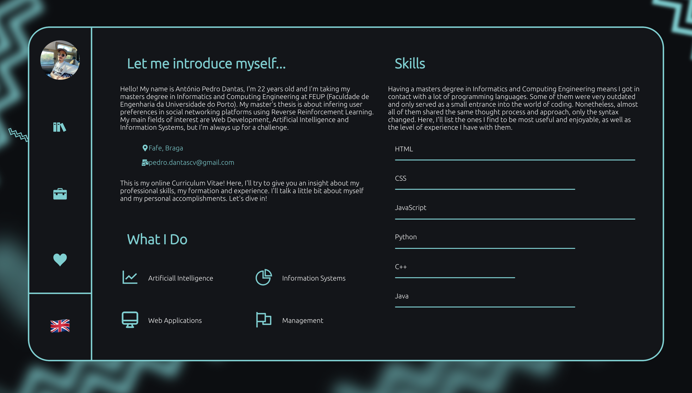

# Online Curriculum Vitae

I developed this project to enhance my frontend skills and get to know the __React__ library a little bit better.
It works as an online CV and Portfolio for myself.



## Run it

* Install node.

* ```yarn install``` and ```yarn start``` on the root folder.

## Access it

* The website is deployed at https://pedrodantas.netlify.app/
